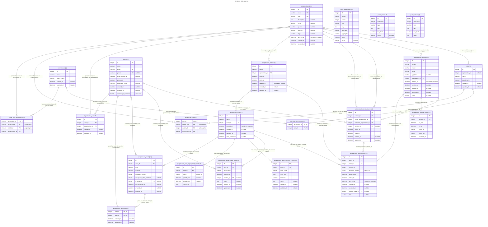

# Entity Relationship Diagram

Auto-generated from current Laravel schema.

Do not edit diagram block manually. Run `composer docs:erd`.

<!-- mermaid-erd-start -->

```mermaid
---
title: 22 tables · 158 columns
---
erDiagram
    model_has_permissions["model_has_permissions (4)"] {
        integer permission_id PK, FK
        varchar model_type PK "polymorphic"
        integer model_id PK "polymorphic"
        integer organization_id PK
    }
    model_has_roles["model_has_roles (4)"] {
        integer role_id PK, FK
        varchar model_type PK "polymorphic"
        integer model_id PK "polymorphic"
        integer organization_id PK
    }
    organization_user["organization_user (5)"] {
        integer id PK
        integer user_id FK
        integer organization_id FK
        datetime created_at "nullable"
        datetime updated_at "nullable"
    }
    organizations["organizations (11)"] {
        integer id PK
        varchar name UK
        varchar slug UK
        text description "nullable"
        varchar email "nullable"
        varchar phone "nullable"
        varchar website "nullable"
        varchar logo "nullable"
        datetime deleted_at "soft-delete, nullable"
        datetime created_at "nullable"
        datetime updated_at "nullable"
    }
    peoplecount_alert_user["peoplecount_alert_user (4)"] {
        integer alert_id PK, FK
        integer user_id PK, FK
        datetime created_at "nullable"
        datetime updated_at "nullable"
    }
    peoplecount_alerts["peoplecount_alerts (10)"] {
        integer id PK
        integer area_id FK
        varchar type
        varchar channel
        integer cooldown_minutes
        integer occupancy_alert_threshold "nullable"
        integer created_by FK "nullable"
        datetime last_triggered_at "nullable"
        datetime created_at "nullable"
        datetime updated_at "nullable"
    }
    peoplecount_area_aggregated_counts["peoplecount_area_aggregated_counts (6)"] {
        integer id PK
        integer area_id FK
        integer count "default: '0'"
        datetime period_start "nullable"
        datetime period_end "nullable"
        blob checksum
    }
    peoplecount_area_recurring_resets["peoplecount_area_recurring_resets (8)"] {
        integer id PK
        integer area_id FK
        integer reset_value
        time reset_time
        varchar timezone
        text notes "nullable"
        datetime created_at "nullable"
        datetime updated_at "nullable"
    }
    peoplecount_area_single_resets["peoplecount_area_single_resets (8)"] {
        integer id PK
        integer area_id FK
        integer reset_value
        datetime effective_at
        integer created_by FK "nullable"
        text notes "nullable"
        datetime created_at "nullable"
        datetime updated_at "nullable"
    }
    peoplecount_areas["peoplecount_areas (7)"] {
        integer id PK
        varchar name
        integer event_id FK
        datetime deleted_at "soft-delete, nullable"
        datetime created_at "nullable"
        datetime updated_at "nullable"
        datetime data_watermark "nullable"
    }
    peoplecount_assignments["peoplecount_assignments (12)"] {
        integer id PK
        integer event_id FK
        integer area_id FK
        integer sensor_id FK
        tinyint direction_flipped "default: '0'"
        datetime active_from
        datetime active_to
        datetime deleted_at "soft-delete, nullable"
        datetime created_at "nullable"
        datetime updated_at "nullable"
        integer sensor_share_id FK "nullable"
        varchar label "nullable"
    }
    peoplecount_events["peoplecount_events (8)"] {
        integer id PK
        varchar name
        integer organization_id FK
        datetime starts_at
        datetime ends_at
        datetime deleted_at "soft-delete, nullable"
        datetime created_at "nullable"
        datetime updated_at "nullable"
    }
    peoplecount_interval_counts["peoplecount_interval_counts (7)"] {
        integer id PK
        integer sensor_id FK
        datetime ts_from
        datetime ts_to
        integer count_in
        integer count_out
        datetime received_at
    }
    peoplecount_sensor_shares["peoplecount_sensor_shares (9)"] {
        integer id PK
        integer sensor_id FK
        integer owner_organization_id FK
        integer borrower_organization_id FK
        integer created_by FK "nullable"
        datetime starts_at
        datetime ends_at
        datetime created_at "nullable"
        datetime updated_at "nullable"
    }
    peoplecount_sensors["peoplecount_sensors (11)"] {
        integer id PK
        varchar vendor
        varchar model
        varchar serial
        varchar api_token "nullable"
        integer organization_id FK
        datetime deleted_at "soft-delete, nullable"
        datetime created_at "nullable"
        datetime updated_at "nullable"
        datetime archived_at "nullable"
        varchar name "nullable"
    }
    permissions["permissions (5)"] {
        integer id PK
        varchar name
        varchar guard_name
        datetime created_at "nullable"
        datetime updated_at "nullable"
    }
    pulse_aggregates["pulse_aggregates (9)"] {
        integer id PK
        integer bucket
        integer period
        varchar type
        text key
        varchar key_hash
        varchar aggregate
        numeric value
        integer count "nullable"
    }
    pulse_entries["pulse_entries (6)"] {
        integer id PK
        integer timestamp
        varchar type
        text key
        varchar key_hash
        integer value "nullable"
    }
    pulse_values["pulse_values (6)"] {
        integer id PK
        integer timestamp
        varchar type
        text key
        varchar key_hash
        text value
    }
    role_has_permissions["role_has_permissions (2)"] {
        integer permission_id PK, FK
        integer role_id PK, FK
    }
    roles["roles (6)"] {
        integer id PK
        integer organization_id "nullable"
        varchar name
        varchar guard_name
        datetime created_at "nullable"
        datetime updated_at "nullable"
    }
    users["users (10)"] {
        integer id PK
        varchar name
        varchar email UK
        varchar phone UK "nullable"
        datetime email_verified_at "nullable"
        varchar password
        varchar remember_token "nullable"
        datetime created_at "nullable"
        datetime updated_at "nullable"
        tinyint eastereggs_activated "default: '1'"
    }
    permissions ||--o{ model_has_permissions : "has many via permission_id, cascade delete"
    organizations ||--o{ model_has_permissions : "guessed has many via organization_id"
    roles ||--o{ model_has_roles : "has many via role_id, cascade delete"
    organizations ||--o{ model_has_roles : "guessed has many via organization_id"
    organizations ||--o{ organization_user : "pivot, has many via organization_id, cascade delete"
    users ||--o{ organization_user : "pivot, has many via user_id, cascade delete"
    users ||--o{ peoplecount_alert_user : "pivot, has many via user_id, cascade delete"
    peoplecount_alerts ||--o{ peoplecount_alert_user : "pivot, has many via alert_id, cascade delete"
    users |o--o{ peoplecount_alerts : "has many via created_by, set null delete"
    peoplecount_areas ||--o{ peoplecount_alerts : "has many via area_id, cascade delete"
    peoplecount_areas ||--o{ peoplecount_area_aggregated_counts : "has many via area_id, cascade delete"
    peoplecount_areas ||--o{ peoplecount_area_recurring_resets : "has many via area_id, cascade delete"
    users |o--o{ peoplecount_area_single_resets : "has many via created_by, set null delete"
    peoplecount_areas ||--o{ peoplecount_area_single_resets : "has many via area_id, cascade delete"
    peoplecount_events ||--o{ peoplecount_areas : "has many via event_id, cascade delete"
    peoplecount_sensor_shares |o--o{ peoplecount_assignments : "has many via sensor_share_id"
    peoplecount_events ||--o{ peoplecount_assignments : "has many via event_id, cascade delete"
    peoplecount_areas ||--o{ peoplecount_assignments : "has many via area_id, cascade delete"
    peoplecount_sensors ||--o{ peoplecount_assignments : "has many via sensor_id, cascade delete"
    organizations ||--o{ peoplecount_events : "has many via organization_id, cascade delete"
    peoplecount_sensors ||--o{ peoplecount_interval_counts : "has many via sensor_id"
    users |o--o{ peoplecount_sensor_shares : "has many via created_by, set null delete"
    organizations ||--o{ peoplecount_sensor_shares : "has many via borrower_organization_id, cascade delete"
    organizations ||--o{ peoplecount_sensor_shares : "has many via owner_organization_id, cascade delete"
    peoplecount_sensors ||--o{ peoplecount_sensor_shares : "has many via sensor_id, cascade delete"
    organizations ||--o{ peoplecount_sensors : "has many via organization_id, cascade delete"
    roles ||--o{ role_has_permissions : "pivot, has many via role_id, cascade delete"
    permissions ||--o{ role_has_permissions : "pivot, has many via permission_id, cascade delete"
    organizations |o--o{ roles : "guessed has many via organization_id"
%% Unmapped polymorphic relations (add to config 'mermaid-erd.polymorphic_relationships'):
%%   model_has_permissions.model (model_type + model_id)
%%   model_has_roles.model (model_type + model_id)
```
<!-- mermaid-erd-end -->
