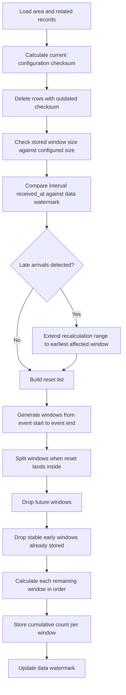

# People Count Aggregation Algorithm

This document describes exact aggregation behavior.

It focuses on rules, boundary handling, and calculation flow.

## Purpose

Aggregation answers one question:

Given event time range, assignments, sensor interval counts, resets, and fixed aggregation window size, what should cumulative area count be at each stored window?

## Core Outcome

For each area, system stores a sequence of windows.

Each window has:

1. start time
2. end time
3. cumulative count at end of that window

Count is cumulative, not per-window-only.

## Terms

### Window

Fixed aggregation period, such as `10:00-10:10`.

### Interval net

`count_in - count_out`

### Flipped interval net

If assignment direction is flipped, interval net becomes negative of normal net.

### Reset value

Explicit starting count that takes effect from reset timestamp forward.

### Data watermark

Timestamp recording the latest `received_at` of interval counts that have been incorporated into aggregation for a given area.

Stored explicitly per area. Updated after each successful aggregation pass.

Used to detect late-arriving data: any interval count with `received_at` after the watermark that falls in an already-aggregated window triggers recalculation.

## Boundary Rules

These boundaries are important because many edge cases depend on them.

### Event range

Aggregation only exists inside event range.

In practice, windows are generated while:

`window_start < event_end`

### Window boundaries

Window start is inclusive.

Window end is exclusive.

Window rule is:

`window.start <= ts_from < window.end`

So:

1. `ts_from = window.start` means interval is included in that window
2. `ts_from = window.end` means interval is excluded from that window and belongs to next one

### Assignment boundaries

Assignment start is inclusive.

Assignment end is exclusive.

Assignment rule is:

`assignment.active_from <= ts_from < assignment.active_to`

So interval starting exactly at `active_from` is eligible.

Interval starting exactly at `active_to` is not eligible.

### Interval selection anchor

Interval inclusion is decided by `ts_from`.

System does not split one interval across multiple windows.

That means `ts_to` does not decide which window gets interval.

Only `ts_from` decides.

## High-Level Flow



## Window Construction

Window size comes from `PEOPLECOUNT_AGGREGATION_GRANULARITY`.

Example with `10 minute` windows:

1. `10:00-10:10`
2. `10:10-10:20`
3. `10:20-10:30`

Natural window end is:

`min(window_start + granularity, event_end)`

If reset falls inside that natural window, window is cut early so reset becomes boundary.

### Pseudocode

```text
current = event_start

while current < event_end:
    natural_end = min(current + granularity, event_end)
    reset_inside = first reset with timestamp between current and natural_end

    if reset_inside exists and reset_inside.timestamp > current:
        window_end = reset_inside.timestamp
    else:
        window_end = natural_end

    emit window(current, window_end, reset_value_if_exactly_at_current)
    current = window_end
```

## Reset Rules

There are three reset sources:

1. Event start reset
   Always exists. Value is `0` at event start.

2. Single reset
   One-time reset at explicit timestamp.

3. Recurring reset
   Repeating reset generated inside event range from local reset time and timezone.

### Same-Timestamp Priority

If more than one reset lands at same timestamp, priority is:

1. single reset
2. event start reset
3. recurring reset

### Reset Effect

If reset timestamp equals window start, that window starts from reset value.

If reset timestamp lands inside window, current window ends at reset time and next window starts from reset value.

### Pseudocode

```text
if reset exists exactly at window.start:
    window_start_value = reset.reset_value
else:
    window_start_value = previous_window_count
```

## Assignment Eligibility

Assignment is first checked at window level.

Assignment is considered active for window when it overlaps that window.

Practical overlap check:

```text
assignment.active_from <= window.end
assignment.active_to >= window.start
```

This is only candidate selection.

Actual interval inclusion is stricter.

In other words:

1. overlap says assignment is worth checking
2. interval rule decides whether each interval is actually counted

## Authoritative Interval Inclusion Rule

An interval is included only when all conditions are true:

1. `interval.ts_from >= window.start`
2. `interval.ts_from < window.end`
3. `interval.ts_from >= assignment.active_from`
4. `interval.ts_from < assignment.active_to`

Consequences:

1. Pre-assignment sensor data is ignored.
2. Interval at exact assignment end is ignored.
3. Missing intervals contribute zero.
4. One interval is counted in at most one window.

Short version:

`window.start <= ts_from < window.end` and `assignment.active_from <= ts_from < assignment.active_to`

### Pseudocode

```text
include interval when:
    interval.ts_from >= window.start
    and interval.ts_from < window.end
    and interval.ts_from >= assignment.active_from
    and interval.ts_from < assignment.active_to
```

## Net Contribution Rule

For each included interval:

1. compute base net = `count_in - count_out`
2. if assignment is flipped, multiply by `-1`
3. add result to window net

### Pseudocode

```text
window_net = 0

for each active assignment:
    for each eligible interval:
        net = interval.count_in - interval.count_out

        if assignment.direction_flipped:
            net = -net

        window_net += net
```

## Duplicate Interval Count Rule

If multiple interval count rows exist for the same `(sensor_id, ts_from, ts_to)` combination, only the row with the latest `received_at` is authoritative.

All other rows for that combination are superseded and must not contribute to any net calculation.

This applies regardless of whether the duplicate carries identical or different `count_in`/`count_out` values.

### Why latest-wins

1. Retransmissions carry same values — summing would inflate counts.
2. Corrections carry updated values — latest is most authoritative.
3. First-wins would ignore corrections.

### Pseudocode

```text
for each group of intervals sharing (sensor_id, ts_from, ts_to):
    authoritative = row with max(received_at)
    use only authoritative in net calculation
```

### Implementation note

Enforce at write time with upsert on `(sensor_id, ts_from, ts_to)`. On conflict, update `count_in`, `count_out`, `received_at`. This prevents duplicates from accumulating.

## Late-Arriving Data Rule

Sensors may buffer and deliver interval counts after their natural time window has already been aggregated and marked stable.

Late arrival is defined as: interval count where `received_at` > area's stored data watermark, and `ts_from` falls within an already-aggregated window.

### Detection

Before incremental tail recalculation begins, system compares interval count `received_at` values against the area's data watermark.

```text
late_intervals = all interval counts where:
    received_at > area.data_watermark
    and ts_from falls in a window with stored aggregated count
```

### Recalculation range extension

If late intervals exist, recalculation range is extended backward to cover the earliest affected window.

```text
if late_intervals is not empty:
    earliest_affected = min(late_intervals.ts_from)
    affected_window = window containing earliest_affected
    recalculate from affected_window.start forward
else:
    proceed with normal incremental tail recalculation
```

### Watermark update

After aggregation completes (including any backfill recalculation), data watermark is updated to:

```text
area.data_watermark = max(received_at) of all interval counts
                      incorporated in this aggregation pass
```

## Cumulative Count Rule

Windows are processed in chronological order.

For each window:

1. determine window start value
2. calculate window net
3. add window net to start value
4. store result as cumulative count for that window

### Pseudocode

```text
current_count = previous_stable_count

for each window in time order:
    if reset exists at window.start:
        start_value = reset.reset_value
    else:
        start_value = current_count

    current_count = start_value + window_net
    store(window.start, window.end, current_count)
```

## Re-Aggregation Rules

System does not rebuild everything on every run.

It first checks whether stored rows are still valid.

### Checksum invalidation

Stored rows include checksum of area configuration used when they were created.

If current checksum does not match stored checksum, those rows are deleted.

This protects aggregation from stale results after changes such as:

1. assignment timing changes
2. assignment direction flip changes
3. event start or end changes
4. reset changes

### Window size invalidation

System examines existing stored window lengths.

If median stored window size differs from current configured size, all stored rows for that area are deleted.

This protects history from being mixed across different aggregation step sizes.

### Late-arrival invalidation

Data watermark is compared against interval count `received_at` values.

If any interval count has `received_at` newer than the watermark and its `ts_from` falls in an already-stable window, those stable windows must be recalculated.

This is distinct from checksum invalidation:

1. checksum invalidation handles configuration changes
2. late-arrival invalidation handles data arrival timing

Both may trigger wider recalculation, but for different reasons.

### Incremental tail recalculation

After invalidation checks, system recalculates only tail portion of history.

Current behavior:

1. older stable windows are kept
2. recalculation starts around second-last stored window
3. seed count comes from around third-last stored window
4. if late-arrival detection extended the range, recalculation starts from the earliest affected window instead

Reason is practical: recent windows are most likely to change because data may arrive late or current period may still be incomplete.

## Edge Cases

## 1. Sensor has pre-assignment data

Example:

- assignment starts at `10:05`
- interval `10:00-10:10` exists

Result:

Interval is ignored because inclusion is based on `ts_from`, and `10:00 < 10:05`.

## 2. Assignment starts inside window

Example:

- window `10:00-10:10`
- assignment starts at `10:07`
- interval starts at `10:00`

Result:

Interval is ignored.

Even though assignment overlaps window, interval start happened before assignment start.

## 3. Assignment ends inside window

Example:

- window `10:20-10:30`
- assignment ends at `10:25`
- interval starts at `10:20`

Result:

Interval counts because interval starts before assignment end.

If another interval starts exactly at `10:25`, it is ignored.

## 4. Reset lands inside natural window

Example:

- natural window `13:00-13:10`
- reset at `13:05`

Result:

System splits into:

1. `13:00-13:05`
2. `13:05-13:10`

Second window starts from reset value.

## 5. Reset at event start

Event start already creates implicit reset to `0`.

If single reset exists at exact event start, single reset wins.

If recurring reset also lands at exact event start, event start wins over recurring reset.

## 6. Recurring reset with timezone

Recurring reset is defined in local timezone, but generated occurrences are converted to UTC before aggregation.

This means reset happens at expected local wall-clock time even when stored and processed in UTC.

## 7. Sparse or missing sensor data

If no eligible interval exists in a window, window net is `0`.

Stored cumulative count simply carries forward unchanged.

## 8. Multiple sensors on same area

Each active assignment contributes independently.

Final window net is sum of all included interval nets across all active assignments.

## 9. Duplicate interval count for same sensor and time range

Example:

- sensor sends interval `10:00-10:10` with `in=5, out=2` at `received_at=10:10:30`
- sensor retransmits same interval with `in=5, out=2` at `received_at=10:11:00`

Result:

Only the row with `received_at=10:11:00` is used. Net is `3`, not `6`.

## 10. Corrected interval count

Example:

- sensor sends interval `10:00-10:10` with `in=5, out=2` at `received_at=10:10:30`
- sensor sends correction with `in=7, out=1` at `received_at=10:15:00`

Result:

Only the corrected row is used. Net is `6`. Original `3` is superseded.

## 11. Late-arriving data for already-stable window

Example:

- event `10:00-12:00`, window size 10min
- aggregation ran at `11:00`, windows `10:00-10:50` are stable, data watermark set to `11:00`
- at `11:45`, sensor delivers buffered intervals for `10:30-10:40`, `10:40-10:50`, `10:50-11:00` — all with `received_at=11:45`

Result:

System detects `received_at=11:45 > watermark=11:00` for intervals in already-stable windows. Recalculation range extended to window `10:30-10:40`. All windows from `10:30` forward are recalculated. Cumulative counts from `10:30` onward change. Watermark updated to `11:45` after pass completes.

## Worked Examples

### Example A: Basic assignment boundary

Given:

- window size `10 minutes`
- event `10:00-10:30`
- assignment `10:05-10:25`
- interval nets:
  - `10:00-10:10` -> `+5`
  - `10:10-10:20` -> `+6`
  - `10:20-10:30` -> `+2`
  - `10:25-10:35` -> `+9`

Result:

1. `10:00-10:10` -> net `0`, cumulative `0`
2. `10:10-10:20` -> net `+6`, cumulative `6`
3. `10:20-10:30` -> net `+2`, cumulative `8`

### Example B: Flipped direction

Given one included interval with:

- `count_in = 10`
- `count_out = 5`
- assignment flipped

Normal net would be `+5`.

Flipped net becomes `-5`.

### Example C: Mid-window reset

Given:

- window size `10 minutes`
- natural window `13:00-13:10`
- current count before window is `42`
- reset to `10` at `13:05`

Result:

1. `13:00-13:05` starts from `42`
2. `13:05-13:10` starts from `10`

Those are two separate windows with separate cumulative outcomes.

### Example D: Late arrival backfill

Given:

- window size `10 minutes`
- event `10:00-12:00`
- one assignment active entire event
- initial aggregation at `11:00` produced:

| Window | Net | Cumulative |
|--------|-----|-----------|
| 10:00-10:10 | +3 | 3 |
| 10:10-10:20 | +2 | 5 |
| 10:20-10:30 | +5 | 10 |
| 10:30-10:40 | 0  | 10 |
| 10:40-10:50 | 0  | 10 |
| 10:50-11:00 | +4 | 14 |

Data watermark set to `11:00`.

Then sensor delivers late data at `11:45`:

- interval `10:30-10:40` net `+7`, `received_at=11:45`
- interval `10:40-10:50` net `+3`, `received_at=11:45`

Next aggregation pass:

1. detects `received_at=11:45 > watermark=11:00`
2. earliest affected `ts_from` = `10:30`
3. recalculation from window `10:30-10:40` forward

Recalculated:

| Window | Net | Cumulative |
|--------|-----|-----------|
| 10:00-10:10 | +3 | 3 |
| 10:10-10:20 | +2 | 5 |
| 10:20-10:30 | +5 | 10 |
| 10:30-10:40 | +7 | 17 |
| 10:40-10:50 | +3 | 20 |
| 10:50-11:00 | +4 | 24 |

Watermark updated to `11:45`.

## Non-Authoritative Helper Logic

Some helper/debug views use simpler calculations for diagnostics.

Those helpers are not aggregation algorithm.

In particular, debug count helpers may ignore:

1. direction flips
2. assignment active periods

So they should not be treated as authoritative occupancy history.

## Summary

Authoritative aggregation logic is built on seven strict ideas:

1. fixed event-bounded windows
2. reset-aware window splitting
3. strict interval inclusion by `ts_from`
4. assignment-aware and direction-aware net calculation
5. cumulative count carry-forward across windows
6. latest-wins deduplication for duplicate interval counts
7. backfill-aware recalculation for late-arriving sensor data

If those seven ideas are preserved, behavior stays aligned with current implementation.
