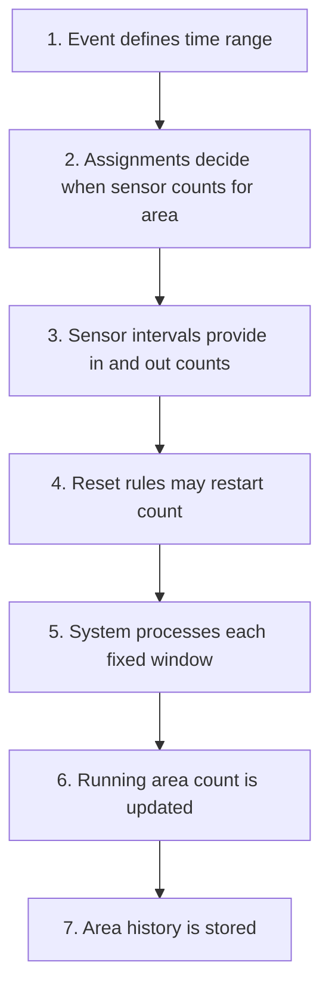
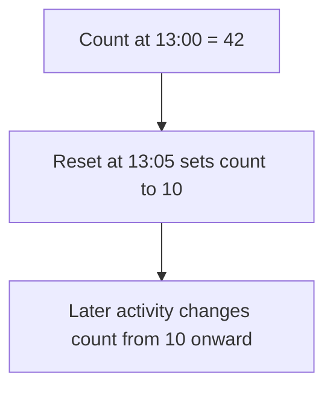

# People Count Aggregation Overview

## What This Feature Does

People count aggregation turns raw sensor activity into an area occupancy history.

At high level:

1. Sensors report counts over time.
2. System decides which sensor counts belong to which area and when.
3. System applies resets when staff intentionally restart count.
4. System stores running area count in time-based steps.

Result is not raw sensor traffic. It is cumulative area count over time after aggregation rules have been applied.

## Why Aggregation Exists

Raw sensor numbers are not enough on their own.

Real-world setup has complications:

- sensor may only belong to area during part of event
- one sensor may count in reverse direction for specific area
- area count may need manual or scheduled reset
- sensors may have data before they were assigned to area
- teams often want stable time-based history, not isolated raw readings

Aggregation handles those rules and turns them into one usable number series.

## Big Picture

## Main Ideas

### `+` Area Count Is Cumulative

Area count is running total.

If one window adds `+5`, and next adds `+3`, area count becomes `8`.

If later window adds `-2`, area count becomes `6`.

### `[]` Assignments Decide When Sensor Counts

Sensor can exist and produce data before it is officially assigned to area.

That earlier data is ignored for that area.

If assignment ends, later sensor data is ignored too.

### `<->` Direction Can Be Flipped

Sometimes sensor is physically installed in way that reverses meaning of `in` and `out` for area.

When assignment is marked as flipped, system reverses net effect for that sensor while that assignment is active.

### `!` Resets Restart Count

Reset says: “From this moment, treat area count as this new value.”

Reset does not edit history before that point. It becomes new starting point going forward.

### `| |` Time Is Processed In Fixed Windows

Aggregation happens in fixed time windows.

In this system, that window size is fixed by configuration.

For example, if step size is `10 minutes`, event timeline is broken into windows like:

1. `10:00-10:10`
2. `10:10-10:20`
3. `10:20-10:30`

Each window gets one cumulative result.

## Simple Example

Imagine:

- event runs from `10:00` to `10:30`
- aggregation window size is `10 minutes`
- one sensor is assigned to area from `10:05` to `10:25`
- sensor reports these interval counts:
  - `10:00-10:10` with net `+5`
  - `10:10-10:20` with net `+6`
  - `10:20-10:30` with net `+2`
  - `10:25-10:35` with net `+9`

What happens:

- `10:00-10:10` is ignored because interval starts before assignment starts
- `10:10-10:20` counts
- `10:20-10:30` counts
- `10:25-10:35` is ignored because interval starts exactly when assignment has ended

So windows become:

1. `10:00-10:10` -> count stays `0`
2. `10:10-10:20` -> count becomes `6`
3. `10:20-10:30` -> count becomes `8`

## Example Visualization

```mermaid
gantt
    dateFormat  HH:mm
    axisFormat  %H:%M

    section Event
    Event                     : 10:00, 10:30

    section Assignment
    Active assignment         : 10:05, 10:25

    section Sensor intervals
    Ignored (+5)              :crit, 10:00, 10:10
    Included (+6)             :done, 10:10, 10:20
    Included (+2)             :done, 10:20, 10:30
    Ignored (+9)              :crit, 10:25, 10:35
```

This shows same raw intervals, but only intervals that start while assignment is active are included.

## Reset Types

There are three reset sources:

1. Event start
   Count starts at `0` unless higher-priority reset exists at same time.

2. Single reset
   Manual one-time reset at exact timestamp.

3. Recurring reset
   Repeating scheduled reset, often daily at same local time.

If more than one reset lands at same timestamp, system uses highest-priority reset.

## Reset Example

Imagine area count has reached `42` by `13:00`.

Team performs reset to `10` at `13:05`.

From that moment:

- history before `13:05` still shows old path
- count at reset point starts from `10`
- later sensor activity adds or subtracts from `10`

## Summary

People count aggregation answers simple question:

“What should area occupancy have been over time, after applying all real-world rules about assignments, sensor direction, resets, and time windows?”

That answer powers current count views, history charts, and alerting.
